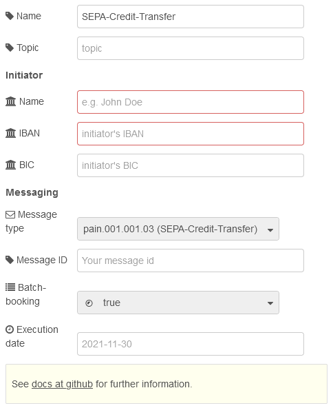

# node-red-contrib-sepa

A [Node-RED](https://nodered.org/)-node that generates SEPA payment files.

## Input
The input accepts a message object with following attributes (values of the object are dummy values):
```json
{
  "topic":  "",
  "initname": "your name",
  "initiban": "DE00123456781234567890",
  "initbic": "MARKDEFFXXX",
  "messagetype": "pain.001.001.03",
  "msgid": "your message id",
  "batchbooking": true,
  "executiondate": "2021-11-11",
  "tx": [
    {
      "name": "your customers name",
      "iban": "your customers iban",
      "amount": 1.23,
      "purpose": "payment description, e.g. invoice-nr",
      "id": "end-to-end-id, customer reference"
    }, 
    {
      ...
    }
  ],
}
```

## Node attributes

An item in the message object with the same name overwrites the values given in the node attributes!



## Output

`msg.payload` contains a xml-string representing the SEPA-payment file. Use the **write file**-node to save as a xml-file.
