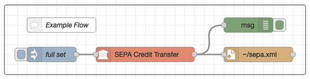

# node-red-contrib-sepa


[Node-RED](https://nodered.org/)-nodes that generates [SEPA](https://en.wikipedia.org/wiki/Single_Euro_Payments_Area) payment files.

At the moment, this project is under development and not for use in production!

## SEPA Credit Transfer
A credit transfer sends money from the initator (debitor) to on or more recipients (creditors). 


### Input
The input accepts a message object with following attributes (values of the object are dummy values):
```json
{
  "topic":  "",
  "initname": "your name",
  "initiban": "DE00123456781234567890",
  "initbic": "MARKDEFFXXX",
  "messagetype": "pain.001.001.03",
  "msgid": "your message id",
  "batchbooking": true,
  "executiondate": "2021-11-11",
  "tx": [
    {
      "name": "your customers name",
      "iban": "your customers iban",
      "amount": 1.23,
      "purpose": "payment description, e.g. invoice-nr",
      "id": "end-to-end-id, customer reference"
    }, 
    {
      ...
    }
  ],
}
```

If `tx.id` is empty, an ISO-timestamp is used instead.

### Node attributes
A corresponding item in the message object overwrites the value given in the node attributes!


## SEPA Direct Debit
A direct debit requests money from one ore more payers. The creditor initiates the payment. The creditor needs a creditor id.


## Input
The input accepts a message object with following attributes (values of the object are dummy values):
```json
{
  "topic":  "",
  "initname": "your name",
  "initiban": "DE00123456781234567890",
  "initbic": "MARKDEFFXXX",
  "creditorid": "DE98ZZZ09999999999",
  "messagetype": "pain.008.001.02",
  "msgid": "your message id",
  "localinstrument": "CORE",
  "sequencetype": "RCUR",
  "batchbooking": true,
  "executiondate": "2021-11-11",
  "tx": [
    {
      "name": "your customers name",
      "iban": "your customers iban",
      "amount": 1.23,
      "purpose": "payment description, e.g. invoice-nr",
      "mref": "mandate id",
      "mdate": "2021-10-15",
      "id": "end-to-end-id, customer reference"
    }, 
    {
      ...
    }
  ],
}
```

If `tx.id` is empty, an ISO-timestamp is used instead.

### Node attributes
A corresponding item in the message object overwrites the value given in the node attributes!


## Output
`msg.payload` contains a xml-string representing the SEPA-payment file. Use the **write file**-node to save as a xml-file.


## Example flow




```json
[{"id":"f74895fa02c284ef","type":"group","z":"a48e0948ab3f8228","style":{"stroke":"#999999","stroke-opacity":"1","fill":"none","fill-opacity":"1","label":true,"label-position":"nw","color":"#a4a4a4"},"nodes":["b9b2b8ee0223ba8d","b7edd1e9c5af78ed","a0d38c6dc8767af8","0f974e0347e06318","5b0d5c15e398c62d"],"x":274,"y":119,"w":612,"h":142},{"id":"b9b2b8ee0223ba8d","type":"inject","z":"a48e0948ab3f8228","g":"f74895fa02c284ef","name":"full set","props":[{"p":"topic","vt":"str"},{"p":"initname","v":"John Doe","vt":"str"},{"p":"initiban","v":"DE00123456781234567890","vt":"str"},{"p":"initbic","v":"MARKDEFFXXX","vt":"str"},{"p":"messagetype","v":"pain.001.001.03","vt":"str"},{"p":"msgid","v":"","vt":"date"},{"p":"batchbooking","v":"true","vt":"bool"},{"p":"executiondate","v":"2021-12-06","vt":"str"},{"p":"tx","v":"[{\"name\":\"Creditor 1\",\"iban\":\"DE00123456780000000001\",\"amount\":1.23,\"purpose\":\"sct1\",\"id\":\"e2e-id 1\"},{\"name\":\"Creditor 2\",\"iban\":\"DE00123456780000000002\",\"amount\":2.34,\"purpose\":\"sct2\",\"id\":\"e2e-id 2\"}]","vt":"json"}],"repeat":"","crontab":"","once":false,"onceDelay":0.1,"topic":"topicFromMessage","x":370,"y":220,"wires":[["a0d38c6dc8767af8"]]},{"id":"b7edd1e9c5af78ed","type":"debug","z":"a48e0948ab3f8228","g":"f74895fa02c284ef","name":"","active":true,"tosidebar":true,"console":false,"tostatus":false,"complete":"true","targetType":"full","statusVal":"","statusType":"auto","x":770,"y":160,"wires":[]},{"id":"a0d38c6dc8767af8","type":"sepa-sct","z":"a48e0948ab3f8228","g":"f74895fa02c284ef","name":"","topic":"topicFromNode","initname":"halli","initiban":"","initbic":"","messagetype":"pain.001.001.03","msgid":"","batchbooking":"true","executiondate":"2024-01-01","x":560,"y":220,"wires":[["b7edd1e9c5af78ed","0f974e0347e06318"]]},{"id":"0f974e0347e06318","type":"file","z":"a48e0948ab3f8228","g":"f74895fa02c284ef","name":"","filename":"~/sepa.xml","appendNewline":true,"createDir":false,"overwriteFile":"false","encoding":"none","x":790,"y":220,"wires":[[]]},{"id":"5b0d5c15e398c62d","type":"comment","z":"a48e0948ab3f8228","g":"f74895fa02c284ef","name":"Example Flow","info":"# Example Flow\n\nThe inject node provides a full set msg object with two transactions. Full set means, that all properties are set within the msg object and no config in the SEPA Credit Transfer node is needed.\n\nThe write file node writes the result into a file named sepa.xml in the users home directory (serverside!). \n","x":390,"y":160,"wires":[]}]
```