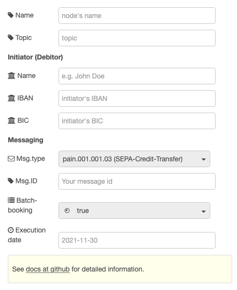

# node-red-contrib-sepa

[Node-RED](https://nodered.org/)-nodes that generates [SEPA](https://en.wikipedia.org/wiki/Single_Euro_Payments_Area) payment files.

At the moment, only the SEPA Credit Transfer node is working, Direct Debit node is experimental!

## SEPA Credit Transfer
A credit transfer sends money from the initator (debitor) to on or more recipients (creditors). 


### Input
The input accepts a message object with following attributes (values of the object are dummy values):
```json
{
  "topic":  "",
  "initname": "your name",
  "initiban": "DE00123456781234567890",
  "initbic": "MARKDEFFXXX",
  "messagetype": "pain.001.001.03",
  "msgid": "your message id",
  "batchbooking": true,
  "executiondate": "2021-11-11",
  "tx": [
    {
      "name": "your customers name",
      "iban": "your customers iban",
      "amount": 1.23,
      "purpose": "payment description, e.g. invoice-nr",
      "id": "end-to-end-id, customer reference"
    }, 
    {
      ...
    }
  ],
}
```

If `tx.id` is empty, an ISO-timestamp is used instead.

### Node attributes
A corresponding item in the message object overwrites the value given in the node attributes!




## SEPA Direct Debit
A direct debit requests money from one ore more payers. The creditor initiates the payment. The creditor needs a creditor id.


## Input
The input accepts a message object with following attributes (values of the object are dummy values):
```json
{
  "topic":  "",
  "initname": "your name",
  "initiban": "DE00123456781234567890",
  "initbic": "MARKDEFFXXX",
  "creditorid": "DE98ZZZ09999999999",
  "messagetype": "pain.008.001.02",
  "msgid": "your message id",
  "localinstrument": "CORE",
  "sequencetype": "RCUR",
  "batchbooking": true,
  "executiondate": "2021-11-11",
  "tx": [
    {
      "name": "your customers name",
      "iban": "your customers iban",
      "amount": 1.23,
      "purpose": "payment description, e.g. invoice-nr",
      "mref": "mandate id",
      "mdate": "2021-10-15",
      "id": "end-to-end-id, customer reference"
    }, 
    {
      ...
    }
  ],
}
```

If `tx.id` is empty, an ISO-timestamp is used instead.

### Node attributes
A corresponding item in the message object overwrites the value given in the node attributes!


## Output
`msg.payload` contains a xml-string representing the SEPA-payment file. Use the **write file**-node to save as a xml-file.
