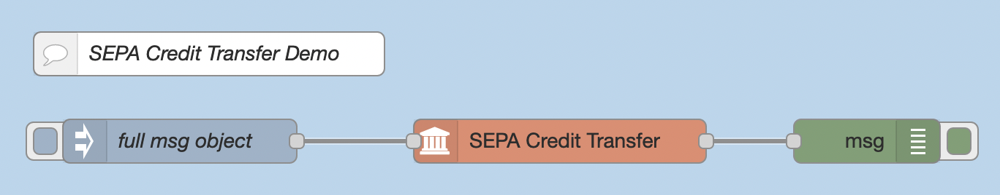
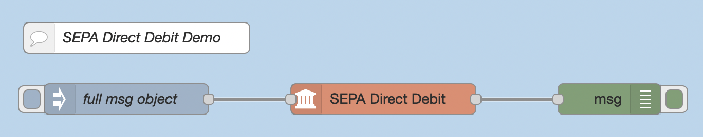

# node-red-contrib-sepa


[Node-RED](https://nodered.org/)-nodes that generates [SEPA](https://en.wikipedia.org/wiki/Single_Euro_Payments_Area) payment files.


# SEPA Credit Transfer
A credit transfer sends money from the initator (debitor) to on or more recipients (creditors). 

The input accepts a message object with following attributes (values of the object are dummy values):

```json
{ "messagetype": "pain.001.001.03",
  "messageid": "my msg id",
  "initname": "John Doe - Debitor",
  "initiban": "DE12500105170648489890",
  "initbic": "INGDDEFF",
  "batchbooking": true,
  "executiondate": "2021-12-15",
  "tx": [
    {
        "name": "Creditor 1",
        "iban": "AT483200000012345864",
        "amount": 1.11,
        "purpose": "purpose 1",
        "id": "id 1"
    },
    {
        "name": "Creditor 2",
        "iban": "CH5604835012345678009",
        "amount": 2.22,
        "purpose": "purpose 2",
        "id": "id 2"
    }
    ]
}
```

If `tx.id` is empty, an ISO-timestamp is used instead.

A corresponding item in the message object overwrites the value given in the node attributes.




# SEPA Direct Debit
A direct debit requests money from one ore more payers. The creditor initiates the payment. The creditor needs a creditor id.

The input accepts a message object with following attributes (values of the object are dummy values):

```json
{ "messagetype": "pain.008.001.02",
  "messageid": "my msg id",
  "initname": "John Doe - Creditor",
  "initiban": "DE12500105170648489890",
  "initbic": "INGDDEFF",
  "batchbooking": true,
  "executiondate": "2021-12-15",
  "creditorid": "DE98ZZZ09999999999",
  "localinstrument": "CORE",
  "sequencetype": "RCUR",
  "tx": [
    {
        "name": "Debitor 1",
        "iban": "AT483200000012345864",
        "amount": 1.11,
        "purpose": "purpose 1",
        "mdtid": "mandate 1",
        "mdtdate": "2021-01-01",
        "id": "e2eid 1"
    },
    {
        "name": "Debitor 2",
        "iban": "CH5604835012345678009",
        "amount": 2.22,
        "purpose": "purpose 2",
        "mdtid": "mandate 2",
        "mdtdate": "2021-02-02",
        "id": "e2eid 2"
    }   
]
}
```

If `tx.id` is empty, an ISO-timestamp is used instead.

A corresponding item in the message object overwrites the value given in the node attributes!



# Output
`msg.payload` contains a xml-string representing the SEPA-payment file. Use the **write file**-node to save as a xml-file.


# Example flows

Import example flows using the **"Import -> Examples"** command in Node-RED menu. 